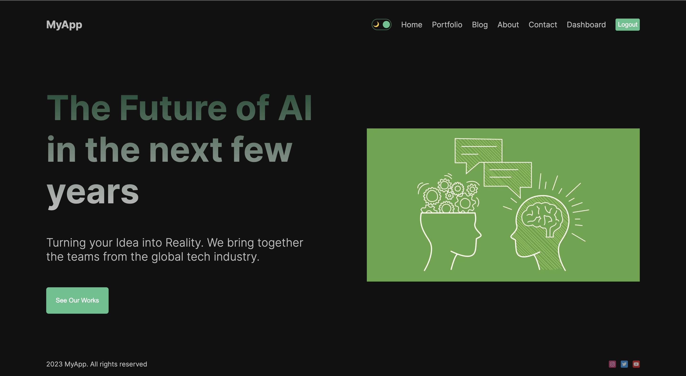

# NEXT 13.4.3 | APP  

View project:  

- Mongoose  
- SWR  
- Bcrypt  
- Next-Auth  
- API  
- CRUD  
- Theme  

### .env  

MONGO=mongodb+srv://<username>:<password>@cluster0.mfxky7w.mongodb.net/test?retryWrites=true&w=majority  

GOOGLE_CLIENT_ID=  
GOOGLE_CLIENT_SECRET=  

NEXTAUTH_SECRET=  
NEXTAUTH_URL=  

---
## Preview:  

